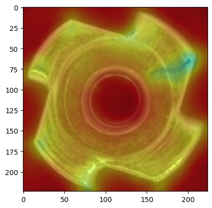

# anomaly-detection
My implementation of PatchCore, PaDim, and SPADE based on their papers with help from their respective github repositories by authors and more. 

**PatchCore** Roth et al., Towards Total Recall in Industrial Anomaly Detection  
**PaDim** Defard et al., PaDiM: a Patch Distribution Modeling Framework for Anomaly Detection and Localization  
**SPADE** Niv Cohen, Yedid Hoshen, Sub-Image Anomaly Detection with Deep Pyramid Correspondences  

## Original images

  
   
  
  

## PatchCore

  
   
  
  

## PaDim

  
   
  
  

## SPADE

  
   
  
  

